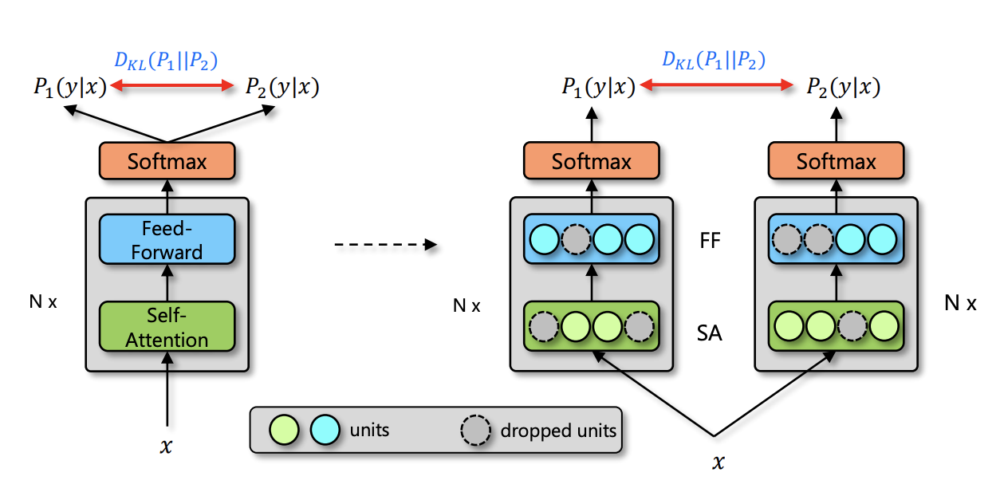

# L_unsloth_

## unsloth

官方文档：https://unsloth.ai/docs/

huggingface 和 unsloth: https://hugging-face.cn/docs/trl/unsloth_integration

文档内容大致就是说Unsloth 是一款 AI 微调工具，可帮助提升机器学习模型的性能。让大型语言模型（如 Llama-3、Mistral、Phi-4 和 Gemma）的微调速度提升 2 倍，内存占用减少，且不会降低准确率。

### 学习与使用unsloth

安装

```bash
pip install unsloth
```

1. 导入unsloth包的核心模块

```python
import unsloth
from unsloth import FastModel, FastLanguageModel  # 高效模型加载和微调工具
```

2. 加载预训练模型与分词器

```python
model, tokenizer = FastModel.from_pretrained(
    model_name=model_name,  # 预训练模型名称（如 "microsoft/deberta-v2-xxlarge"）
    load_in_4bit=False,     # 是否启用 4bit 量化（True 可大幅节省显存，适合大模型）
    max_seq_length=2048,    # 最大序列长度（根据任务调整）
    dtype=torch.bfloat16,   # 数据类型（bfloat16 比 float16 精度更高，适合GPU支持的情况）
    auto_model=AutoModelForSequenceClassification,  # 模型类型（这里是序列分类）
    num_labels=NUM_CLASSES, # 分类任务的类别数
    gpu_memory_utilization=0.8  # GPU 内存利用率上限（避免显存溢出，可按需调整）
)
```

load_in_4bit 是 unsloth 的特色功能，启用后可将模型显存占用降低 75%，适合显存有限的场景；gpu_memory_utilization 自动控制内存分配，防止 OOM。

3. 配置 LoRA 微调

```python
model = FastModel.get_peft_model(
    model,
    r=16,  # LoRA 秩（控制参数数量，常用 8/16/32，值越大拟合能力越强但参数越多）
    lora_alpha=32,  # LoRA 缩放参数（通常为 r 的 2 倍）
    lora_dropout=0,  # Dropout 率（0 时计算效率更高）
    bias="none",  # 是否微调偏置参数（"none" 最常用，节省资源）
    use_gradient_checkpointing="unsloth",  # 启用梯度检查点（"unsloth" 模式更省显存）
    random_state=3407,  # 随机种子，保证结果可复现
    task_type="SEQ_CLS",  # 任务类型（序列分类）
)
```

&nbsp;

#### 代码中的UnslothSafeTrainer

代码中继承了Trainer类重写了prediction_step()方法

```python
"""
        安全的 prediction_step：**不** 调用 model.prediction_step（避免 unsloth 的 monkey-patch）。
        直接使用 model(**inputs) 并提取 loss/logits/labels。
        """

        def prediction_step(
                self,
                model,
                inputs: Dict[str, Any],
                prediction_loss_only: bool,
                ignore_keys: Optional[Tuple[str]] = None,
        ):
            # 把 inputs 放到设备上（复用 Trainer 的内部方法）
            inputs = self._prepare_inputs(inputs)

            # 获取是否有 labels（有时 key 叫 labels，有时叫 label）
            labels = None
            if isinstance(inputs, dict):
                labels = inputs.get("labels", inputs.get("label", None))

            # 直接用 forward（不要调用 model.prediction_step）
            with torch.no_grad():
                outputs = model(**inputs)

            # 解析 outputs：支持 dict 或 tuple
            loss = None
            logits = None

            # 如果 model 返回 dict（huggingface 习惯），尽量取标准字段
            if isinstance(outputs, dict):
                # loss 可能在 outputs['loss']
                loss = outputs.get("loss", None)
                # logits 可能在 outputs['logits'] 或 outputs['predictions']
                logits = outputs.get("logits", outputs.get("predictions", None))
            elif isinstance(outputs, tuple):
                # tuple 常见格式: (logits, ...) 或 (loss, logits, ...)
                if len(outputs) == 0:
                    logits = None
                elif len(outputs) == 1:
                    logits = outputs[0]
                elif len(outputs) == 2:
                    # 一般 (loss, logits) 或 (logits, labels) —— 尝试智能判断
                    a, b = outputs[0], outputs[1]
                    # 若 a 是标量 tensor 且 b 不是标量，猜 a 是 loss
                    if getattr(a, "ndim", None) == 0 or (isinstance(a, torch.Tensor) and a.numel() == 1):
                        loss = a
                        logits = b
                    else:
                        logits = a
                else:
                    # 常见 (loss, logits, ...) 或 (logits, ...)
                    # 优先把第一个标量当 loss，第二个当 logits
                    if getattr(outputs[0], "ndim", None) == 0 or (
                            isinstance(outputs[0], torch.Tensor) and outputs[0].numel() == 1):
                        loss = outputs[0]
                        logits = outputs[1] if len(outputs) > 1 else None
                    else:
                        logits = outputs[0]

            # 有时候 loss 在 outputs.loss，但未转到 cpu，保持 tensor
            if prediction_loss_only:
                # 只返回 loss 情况
                return (loss, None, None)

            # 确保 logits、labels 都在 cpu/device 上与 Trainer 期望一致
            return (loss, logits, labels)
```

——为什么需要重写？
Unsloth 为了优化性能，会对模型做 monkey-patch（运行时修改方法）。这导致 HuggingFace Trainer 原生的 prediction_step() 可能会调用到被 Unsloth 修改过的方法，产生意外行为或报错。

&nbsp;

修改的内容如下：

predict(test_dataset):
       
prediction_step()

 _prepare_inputs()  → 数据移到GPU
 
model(**inputs)    → 直接forward，绕过Unsloth patch

解析outputs        → 兼容dict/tuple格式

 return (loss, logits, labels)


&nbsp;

#### Unsloth具体patch了什么？

Unsloth 主要优化这些方面：

1. Attention 计算 - 用更高效的 kernel 替换原生实现

2. 梯度检查点 - use_gradient_checkpointing="unsloth" 用自己的实现

3. LoRA 层的前向传播 - 优化 LoRA 的矩阵运算

4. 内存管理 - 修改某些中间变量的处理方式


&nbsp;
&nbsp;


### R-drop( Regularized Dropout)

原文：https://arxiv.org/pdf/2106.14448


#### KL散度(Kullback-Leibler divergence)

KL散度常用于衡量两个分布之间的差异。衡量当我们使用一个近似概率分布 Q 来建模或描述一个真实概率分布 P 时的信息损失。


 在机器学习中x通常是离散变量,分布 Q(X)与 P(X) 的KL散度计算公式为：

 $$
 KL(P||Q) = \sum_{x∈X}P(x)ln[P(x)/Q(x)]
 $$

根据公式也不难看出：当KL散度越小，意味着分布 Q 对分布 P 的拟合程度越高(损失越小)。

——KL散度在机器学习上的两种应用场景：

1. 监控变量分布

模型一般是基于历史样本训练的，所以随着时间推移，可能不适用于当前数据。此时，可以使用KL散度来监控线上变量的分布是否与建模时的训练数据的分布一致。当KL散度大于一定阈值时，就自动发警报，方便建模人员进行分析与采取相关措施。

2. **作为损失函数的正则项**

在训练模型的时候，可以用KL散度作为正则项，强制使模型的预测值趋向目标分布。使用KL散度作为正则项，可以抵抗过拟合，它可以使模型预测值的分布更加合理化  

#### R-Drop分析

R-Drop 是一种基于 Dropout 的正则化方法。Dropout 通过随机丢弃神经元来防止过拟合。而R-Drop 通过强制不同子模型的输出分布一致性来进一步增强 Dropout 的效果。

##### Dropout的问题：

1. 训练阶段：Dropout 随机关闭部分神经元，损失是多次损失的平均，以此抑制过拟合。

2. 推理阶段：关闭 Dropout，使用完整模型与全部神经元，导致训练时的随机子模型与推理时的全模型存在分布与行为差异，由于训练 - 推理不一致，影响最终性能。

##### R-Drop

核心思想：R-Drop 通过 “两次前向传播 + 双向 KL 散度约束” 强制输出一致。

1. 同一样本 x 在同一 batch 内两次通过带 Dropout 的模型，得到两个独立的输出分布 P₁与 P₂。

2. 计算 P₁与 P₂的双向 KL 散度（对称 KL），作为一致性损失 L_kl，迫使两次输出分布尽可能接近。

3. 总损失为原任务损失（如交叉熵 L_nll）与一致性损失的加权和：
L_total = L_nll + α × L_kl 其中 α 为超参数，控制一致性约束的强度（α常取 0.1–1.0）。

4. 推理阶段与标准 Dropout 一致：关闭 Dropout，使用完整模型预测，消除训练 - 推理的分布偏移。



##### imdb_bert_rdrop中实现：

```python
def forward(self, input_ids=None, attention_mask=None, token_type_ids=None, labels=None):
    # ========== 第一次前向传播 ==========
    outputs = self.bert(input_ids, attention_mask, token_type_ids)
    pooled_output = outputs[1]
    pooled_output = self.dropout(pooled_output)  # ← dropout 随机丢弃一些神经元
    logits = self.classifier(pooled_output)

    # ========== 第二次前向传播（同样的输入！）==========
    kl_outputs = self.bert(input_ids, attention_mask, token_type_ids)
    kl_output = kl_outputs[1]
    kl_output = self.dropout(kl_output)  # ← 同一个 dropout，但随机 mask 不同！
    kl_logits = self.classifier(kl_output)

    # ========== 计算损失 ==========
    if labels is not None:
        loss_fct = nn.CrossEntropyLoss()
        loss = loss_fct(logits.view(-1, self.num_labels), labels.view(-1))      # CE loss 1
        ce_loss = loss_fct(kl_logits.view(-1, self.num_labels), labels.view(-1)) # CE loss 2
        
        # ========== R-Drop 的核心：KL 散度正则 ==========
        kl_loss = (KL(logits, kl_logits) + KL(kl_logits, logits)) / 2.
        
        total_loss = loss + ce_loss + kl_loss
```

为什么用双向 KL？

```python
kl_loss = (KL(P₁ || P₂) + KL(P₂ || P₁)) / 2
```

因为 KL 散度不对称：KL(P||Q) ≠ KL(Q||P)

双向 KL 保证：
P₁ 要接近 P₂,P₂ 也要接近 P₁

&nbsp;

### Supervised Contrastive Learning(监督对比学习)

论文：https://arxiv.org/abs/2004.11362

#### 对比学习

简单来说，对比学习不直接学习 “样本的标签是什么”，而学习 “样本之间的相似关系”—— 通过构建 **正负样本对** ，让模型学会分辨 “哪些样本是同类、哪些是异类”，最终得到的特征既能保留样本的核心语义。

对比学习的本质是 “在特征空间中拉近相似样本、推开不相似样本”。用真实标签替代数据增强来定义 “相似” 与 “不相似”，大幅提升特征的判别能力。

&nbsp;

#### 监督对比学习

**直接利用样本的类别标签定义正负样本：**

正样本：同一标签的所有样本（无论是否经过数据增强）

负样本：不同标签的所有样本

这种方式更精准地对齐任务目标，在下游任务（如分类）上的特征迁移效果远超无监督对比学习。

##### SupCon（监督）:

  猫图片1 → 表示1 ─┐
  
  猫图片2 → 表示2 ─┼─ 这些都要接近（同类）
  
  猫图片3 → 表示3 ─┘

  狗图片1 → 表示4 ─┐
  
  狗图片2 → 表示5 ─┼─ 这些要远离猫的表示（异类）


##### 对比损失函数

batch 中的样本 i，损失为：

$L_i = -\frac{1}{|P(i)|} \times \sum_{p \in P(i)} \log\left[ \frac{\exp(z_i \cdot z_p / \tau)}{\sum_{a \neq i} \exp(z_i \cdot z_a / \tau)} \right]$

1. z_i = 样本 i 的归一化表示向量

2. P(i) = 与样本 i 同类的所有样本集合（正样本）

3. τ = 温度参数（控制分布的平滑程度）
   
4. 分母是所有非自身样本的相似度之和

##### 举例说明：

**样本与表示对应关系**

样本: &nbsp;&nbsp; $\boldsymbol{●_1}$ &nbsp;&nbsp; $\boldsymbol{●_2}$ &nbsp;&nbsp; $\boldsymbol{●_3}$ &nbsp;&nbsp; $\boldsymbol{○_1}$ &nbsp;&nbsp; $\boldsymbol{○_2}$ &nbsp;&nbsp; $\boldsymbol{○_3}$

表示: &nbsp;&nbsp; $\boldsymbol{z_1}$ &nbsp;&nbsp; $\boldsymbol{z_2}$ &nbsp;&nbsp; $\boldsymbol{z_3}$ &nbsp;&nbsp; $\boldsymbol{z_4}$ &nbsp;&nbsp; $\boldsymbol{z_5}$ &nbsp;&nbsp; $\boldsymbol{z_6}$

**针对 $\boldsymbol{●_1}$ 的正负样本划分**
- 正样本（同类）: $\boldsymbol{●_2,\ ●_3}$
- 负样本（异类）: $\boldsymbol{○_1,\ ○_2,\ ○_3}$

**$\boldsymbol{Loss_1}$ 计算项**

$$
\log \frac{\exp(z_1 \cdot z_2 / \tau)}{\exp(z_1 \cdot z_2 / \tau) + \exp(z_1 \cdot z_3 / \tau) + \exp(z_1 \cdot z_4 / \tau) + \exp(z_1 \cdot z_5 / \tau) + \exp(z_1 \cdot z_6 / \tau)}
$$

> 分母中 $\boldsymbol{\exp(z_1 \cdot z_4 / \tau) + \exp(z_1 \cdot z_5 / \tau) + \exp(z_1 \cdot z_6 / \tau)}$ 对应负样本项，**要让它们的整体值更小**

&nbsp;

&nbsp;

##### imdb_bert_scl_trainer.py 和 loss.py中的scl

imdb_bert_scl_trainer.py 中 SCL 体现在 forward() 函数的这部分

```python
def forward(self, input_ids=None, attention_mask=None, token_type_ids=None, labels=None):
    outputs = self.bert(input_ids, attention_mask, token_type_ids)
    pooled_output = outputs[1]  # [CLS] 的表示向量
    pooled_output = self.dropout(pooled_output)
    logits = self.classifier(pooled_output)

    loss = None
    if labels is not None:
        # 1. 普通的交叉熵损失
        loss_fct = nn.CrossEntropyLoss()
        ce_loss = loss_fct(logits.view(-1, self.num_labels), labels.view(-1))

        # 2. 监督对比学习损失 ← SCL 在这里！
        scl_fct = losses.SupConLoss()
        scl_loss = scl_fct(pooled_output, labels)

        # 3. 组合损失
        loss = ce_loss + self.alpha * scl_loss  # alpha = 0.2

```

loss.py 中的关键部分:

```python
def forward(self, features, labels=None, mask=None):
    # features: [batch_size, hidden_dim] 每个样本的表示向量
    # labels: [batch_size] 每个样本的类别
    
    # 1. 构建 mask：同类为 1，异类为 0
    labels = labels.view(-1, 1)
    mask = torch.eq(labels, labels.T).float()  # [batch, batch]
    # mask[i][j] = 1 如果样本 i 和 j 同类
    
    # 2. 计算所有样本两两之间的相似度
    anchor_dot_contrast = torch.matmul(features, features.T) / self.temperature
    # [batch, batch] 的相似度矩阵
    
    # 3. 去掉自己和自己的相似度（对角线）
    logits_mask = 1 - torch.eye(batch_size)
    
    # 4. 计算 softmax 分母（所有非自身样本）
    exp_logits = torch.exp(anchor_dot_contrast) * logits_mask
    log_prob = anchor_dot_contrast - torch.log(exp_logits.sum(1, keepdim=True))
    
    # 5. 只取正样本的 log_prob，求平均
    mean_log_prob_pos = (mask * log_prob).sum(1) / mask.sum(1)
    
    # 6. 最终 loss
    loss = -mean_log_prob_pos.mean()
```

&nbsp;

&nbsp;

## kaggle平台上运行与测评的结果

|  | imdb_modernbert_unsloth.py | imdb_bert_rdrop.py | imdb_bert_scl_trainer.py |
|-----|-----|-----|-----|
| Score | \ | 0.93604 | 0.91660 |

&nbsp;

### kaggle上的版本

1. https://www.kaggle.com/code/ruiluu/imdb-modernbert-unsloth

2. https://www.kaggle.com/code/ruiluu/imdb-bert-rdrop

3. https://www.kaggle.com/code/ruiluu/imdb-bert-scl-trainer
